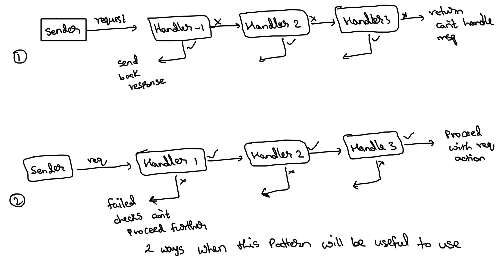
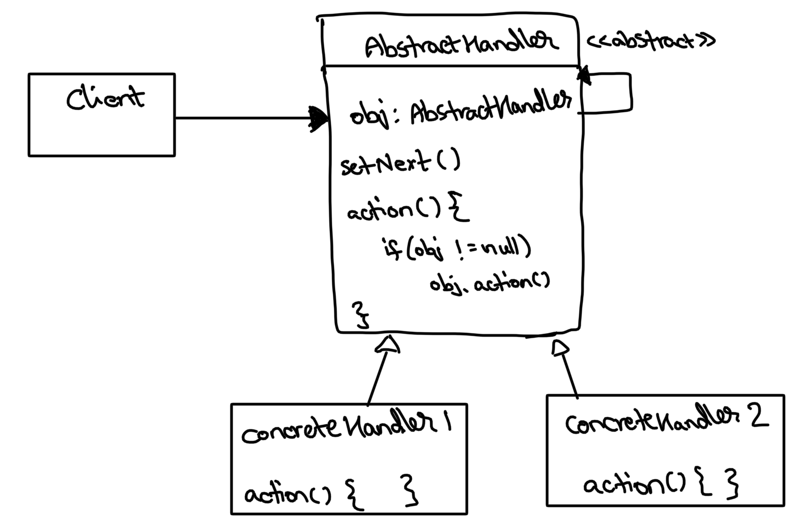

# Chain of Responsibilities

This is a Behavioral design pattern.

**Direct application Use cases:**
1. Design ATM or Vending machine - type 1
    - ATM has different handlers for different denominations of currency.
2. Design Logger - type 1
3. Authentication/Authorisation system—type 2
    - each handle would validate some aspect of the authorization (check email, check password, check ip, etc.).
4. ....

Whenever a sender sends a request, and it isn’t concerned about who amongst the receiver’s would fulfill that request.
This is where chain of responsibilities pattern can be used.

It has two implementation variants:

**Type-1:** The request will be propagated forward till a suitable receiver for processing that request isn’t identified.
Whichever receiver fulfilling the request, will send back the response to the sender directly,
and propagation would be stopped.
Useful when the client doesn't know which handler will be able to process the request.
It would just shoot the request and let the chain check if it can be processed and by whom.

**Type-2:** Alternatively, the chain can keep going forward if the current handler succeeds, if any handler fails the
checks, then we can send back a failed message to sender.
If all receivers succeed then we can pass to whichever is the main action that is to be performed.

### class diagram

Each concrete handler class needs to extend the Abstract handler class, this will help us decouple the code from the
concrete class and allow us to compose different chains during runtime.

Through chaining the handlers dynamically (based on a use case), we can avoid code duplication.

In the code implementation:
- logger class is for type-1 
- validator class is for type-2
