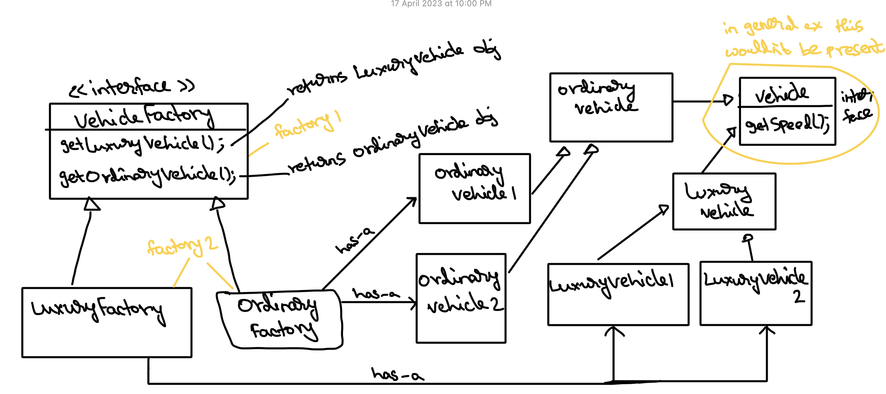

# Factory and Abstract Factory pattern

It is a Creational design pattern.

**Factory pattern** is used when we want to create an object, on the basis of some conditions.

Something like, if condition 1 ⇒ then create obj type 1 and so on.

Through this pattern, we can avoid having to write these condition blocks at multiple places
in our code base. The factory class would act as a single source of truth for handling these conditions and helps avoid code duplication.

**Abstract Factory pattern** is an extension over Factory pattern. It's like a factory of factories
and can be used when logical grouping of class types is possible.

The client code would work with the abstract interfaces of the Factory and underlying Objects
rather than directly working with the concrete classes.
This allows for the factory and object types to be changed (or)
new types to be added without breaking the client's code. 

In code, an Abstract factory pattern has been implemented.

### Difference:
- Abstract Factory deals with creating families of related objects, whereas, Factory Pattern deals with creating one type of object.

### Additional reads:
- https://refactoring.guru/design-patterns/factory-method
- https://refactoring.guru/design-patterns/abstract-factory
