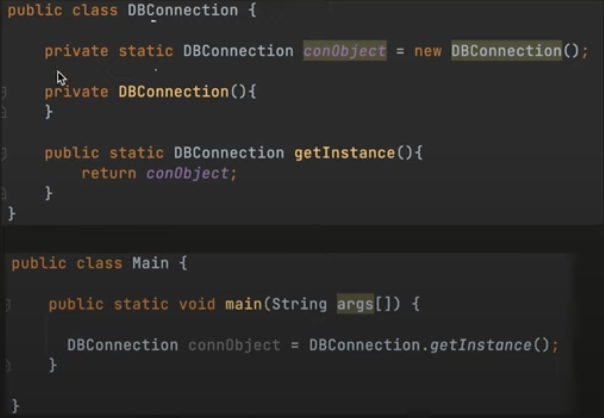
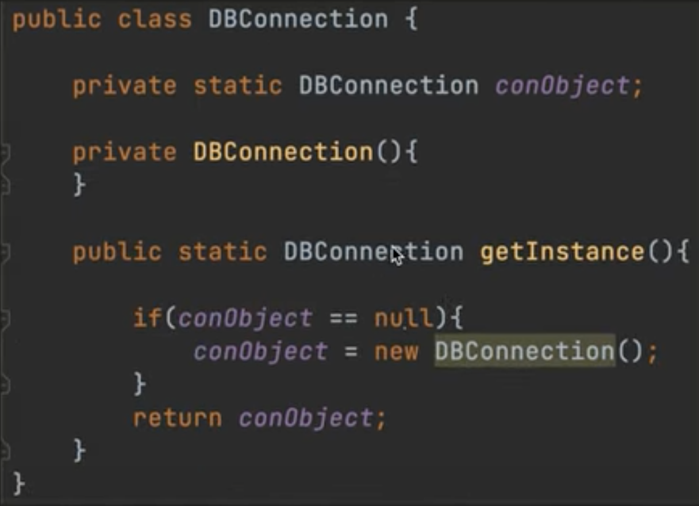
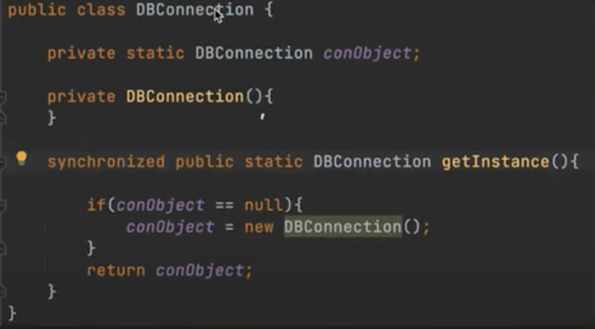
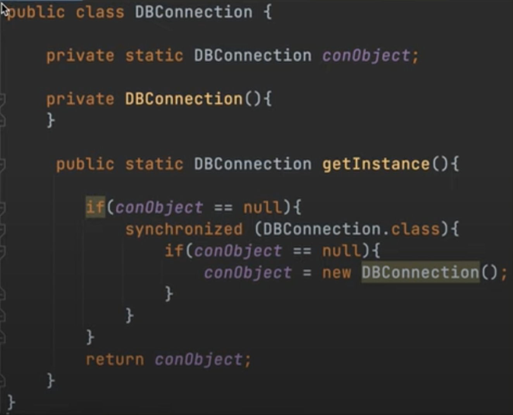

# Singleton design pattern

This is a creational design pattern. It is used when we have to create only 1 instance of a class.

### Use-case:
1. DB connector 
2. Some class that needs to load data from file system (involves heavy I/O operations) during initialisation

### There are 4 ways to achieve this:
1. Eager
2. Lazy
3. Synchronized method
4. Double locking (used in the industry)

In singleton pattern, we are needed to restrict the creation of the object - achieved by making the constructor of 
that class private.

## Eager initialisation:



The object variable is made as static, to make the variable related to the class rather than to a single object instance.
The object will get **initialised eagerly during the class loading phase** itself, instead of when the class is tried to 
be initialised.

Also, the constructor is made private, so that no other class can create an object of this class.

## Lazy initialisation:



Instead of creating the instance at load time itself, we initialise it when it’s actually needed for the first time.
Problem: if multiple threads try to get an instance simultaneously, then both will try creating the instance 
(as for them the obj is still null), so multiple obj will get created in memory due to interleaving's
-> can be solved by making the getInstance method synchronized

## Synchronized method:



This helps avoid race conditions by treating the conObject as shared resource. But this is very expensive, 
especially when there are a lot of requests coming in - as each call needs to acquire the lock every time.

## Double locking:



This is used to avoid locking for every request which pops up while using a synchronised methods in Java.

Locking happens only when object is being initialised for the first time - achieved through synchronised block, 
which locks the class when object is being initialised (and this of course happens only once).

Only the initial few threads will apply a lock on the class, while all the following ones will just 
move on with using the already created object instance. We do double-check on whether locking needs 
to be done or not, to avoid create multiple instances due to interleaving's.

There can be a memory issues with this implementation though, let’s discuss them below.

##### Issue with double locking: L1 Caching
It could happen that thread 1 create an object and that has been written to the cache associated with the core that 
executed the initialisation operation and is yet to write to RAM. 
```
Each core has its own L1 cache, data is written o L1 cache before being written to RAM (common memory)
```

In this case if a 2nd thread running on different core checks the condition and would see that the obj is still 
null (as obj not yet written to RAM) and ends up initialising the obj again (thread 1 created obj is in 
L1 cache of it's core and not in RAM, common memory).

**Fix:** using volatile keyword for the singleton object
Just say `private static volatile DBConnection conObject;` instead of `private static DBConnection conObject;`

**How?**
Volatile variables are always reads and writes from memory directly, no L1 cache step is involved in between.