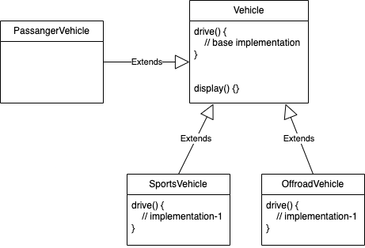

# Strategy design pattern

It is a Behavioural design pattern.

It can happen that different child classes might want to have their own implementation
of the base methods. And in this process we identify that few child classes have
the exact same overridden implementations.

### Use-case:
Child classes are having same code logic which isn’t implemented
by the base code. Helps reduce code redundancy.

### Problems
code duplication keeps increasing when scaling with more child classes
and the overridden method implementation is common amongst multiple child’s,
but different from the base implementation.

Here implementation-1 is the repeated code.

### Solution

The DriveStrategy is decided by the child class and injected using super.
Depending on which DriveStrategy's child class obj is injected,
the respective drive method gets called. The implementation is
out of the child classes and only thing they need to do is to
inject the respective DriveStrategy's obj that they want to use.

Here we are essentially trying to separate out the dependency of
drive method from the parent class by making various strategies that
can be injected dynamically based on child classes requirements.
