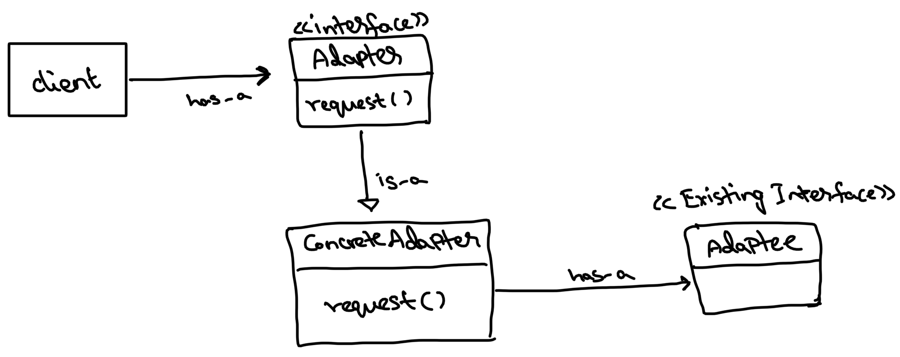

# Adapter pattern

This is a structural design pattern. It allows for objects with incompatible interfaces to collaborate.

It’s like a bridge between an existing interface and an expected interface.

Client wants to use existing interface (Adapter), but they’re incompatible and hence can’t use it directly.
That’s where adapter comes into the scene, it implements the interface that’s compatible with the client and 
knows how to talk to the existing interface.
Thus acting like a bridge.

### Use cases
1. **Power adaptor and socket**
    1. **client** - apple us charger
    2. **Adaptee** - Indian round socket
    3. **Adaptor** - square pin to round pin converter, implements square pin and knows how to talk with the round pin.
2. **XML to JSON parser**
    1. **Client** - knows and wants only JSON
    2. **Adaptee** - server which returns only XML
    3. **Adaptor** - a converter plugin/server/middleware, this converts XML to JSON and returns JSON

Adaptor can handle the necessary conversion login and return final response.
This helps, especially when the output of some service is used at multiple places in our clients code.
If there is any server side code change, then only the convention login within adaptor needs to be updated.
If no adaptor, then all the code blocks using the server’s response need to update their logic
(thus helping in reducing code redundancy)
