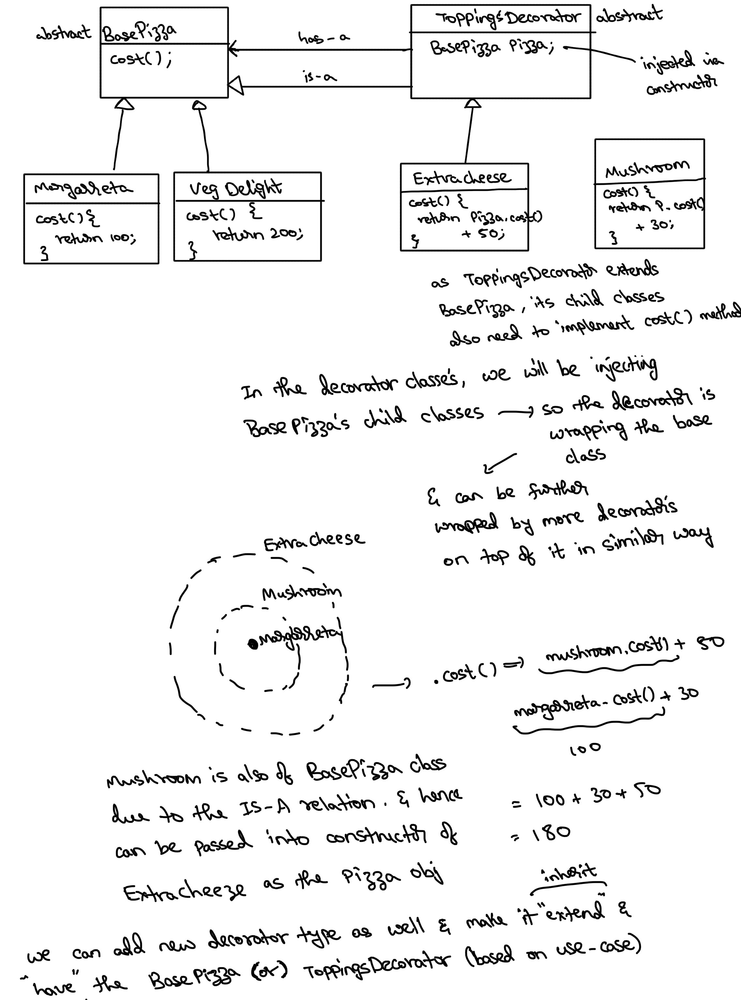

# Decorator pattern

It is a Structural design pattern.

We have a base object which has some features say F1 and F2.
To add additional features say F3 to this class on top of the
existing one, we wrap it inside a decorator class, this 
new feature F3 is added in the decorator class.
Another class can decorate this decorator class by adding even more features.
This decoration can go on to add newer features as time passes by.

Use-case:
In a pizza shop
1. Pizza would be the base obj
2. We can add topping on it (decorator)
3. We can add even extra topping on this (second decorator)
4. ......

Why is it necessary: To avoid class explosion
i.e., making a new class for each new feature will just explode the number
of classes that we would have, leading to problems with code management.
Ex:
- Supreme
- SupremeChicken
- SupremeChickenPineapple
- SupremeChickenExtraCheese
- SupremeShrimp
- SupremeShrimpPineapple
- SupremeShrimpExtraCheese
- ......

The permutations of the # classes will keep increasing for every
new feature being added. Leading to many classes having to be implemented.
Consider the below instance

2—base classes, 3—non-veg types, three - toppings
- without decorator pattern: 2 * 3 * 3 = 18 classes
- with decorator pattern: 2 + 3 + 3 = 8 classes

