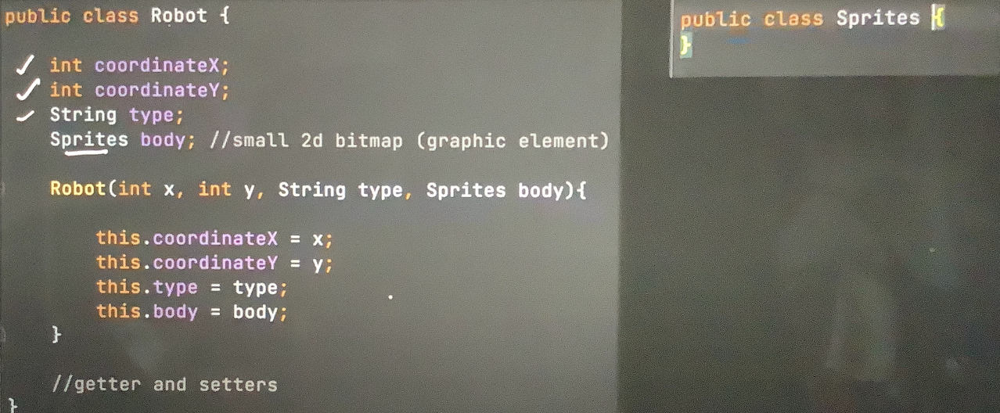
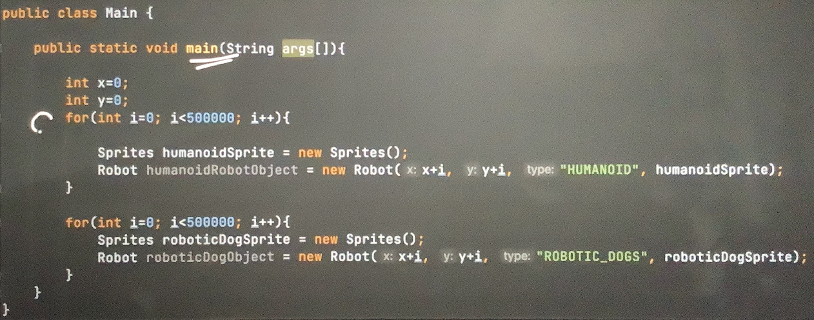
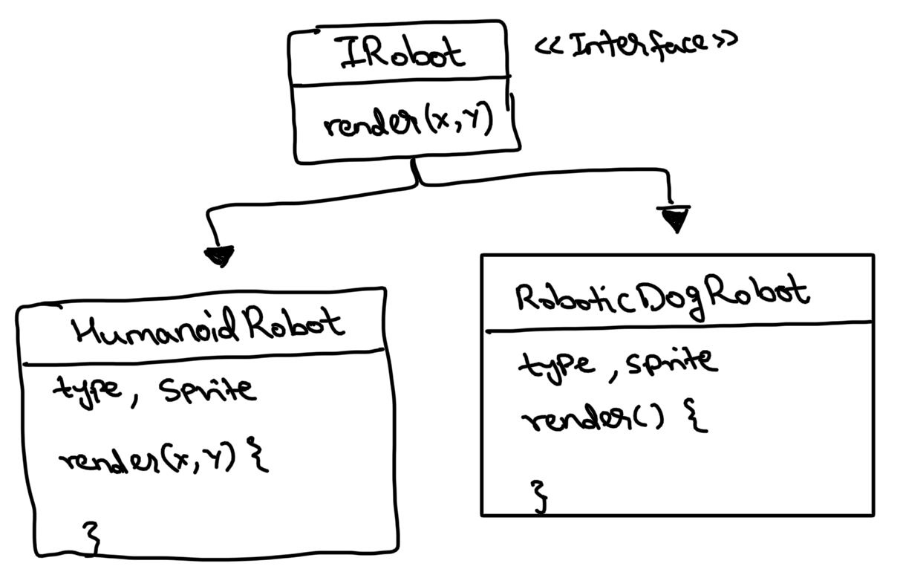
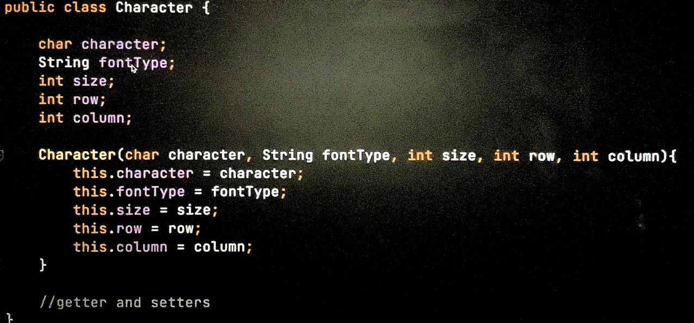
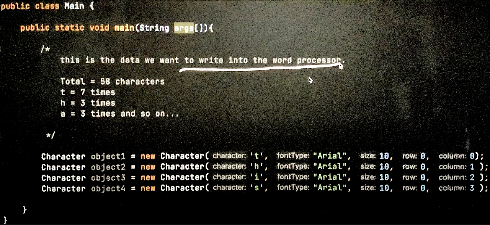

# Flyweight design pattern

This is a structural design pattern.

Common interview questions using this pattern:
1. Design Word processor
2. Design Game

This pattern helps **reduce the memory usage** by sharing data among multiple objects.

### When is this pattern useful?

- When memory is limited
- When objects can share some data (that represent the obj)
    - Intrinsic data: remains same once defined, can be shared amongst objs - type & sprite (below ex)
    - Extrinsic data: changes based on client inputs and can diff from obj to obj - X, Y coordinates (below ex)

### The Issue it solves in a Gaming scenario:
Let’s say we want to create a lot of robot objs in our game, to create a robot army (of different types)

This will create humanoid and robotic dog robots, 5,00,000 objs each. Each obj will 
take some space in the memory → assume it for each obj
- coordinateX - 4b
- coordinateY - 4b
- type—50b (max 50-length string)
- sprite—30kb (it's a graphic element and hence will take more memory)

For each obj ~31kb ⇒ for 10,00,000 objs ~31Gb in memory (very high RAM will be needed to hold all the 
10,00,000 objs needed for the army)

### How to use this pattern and solve the above issue?

- From the class, remove all the extrinsic data and only keep intrinsic data (Flyweight class)—basically a class that
only has intrinsic data in it.
- This Flyweight class will be immutable
- Extrinsic data is passed to Flyweight class as method parameters
- Flyweight obj is cached and reused whenever required. Only one instance of flyweight obj.

As we can see, the data that can be shared amongst humanoid type robots and robotic dog type robots is only present 
inside the classes.
Extrinsic data is being passed to render method as method parameters (arguments).
In this way, we 
don't need 10,00,000 different objs but just 2 objs, drastically reducing the memory requirement.

For caching, we can create a RobotFactory. We can maintain a hashmap inside it and retrieve the obj if already created.

So here, unlike earlier approach, where we were creating many objs, now we’re simply having a common obj which behaves 
according to the extrinsic data being passed to its methods. Saving us an awful lot of memory.

### The Issue it solves in Word Processor:

In the above case, as there are 58 characters to be written,
out program needs to create 58 objs, one for each character to 
be processed.
When there are lakhs of character memory will blow off, as we’re creating lakhs of objs.

We can make use of a flyweight pattern here, intrinsic data will be character, fontType, size—we will need only 
62 objects (A-Za-z0-9) in total irrespective of doc length.

All these 62 objs can be created, cached and maintained using a LetterFactory.

